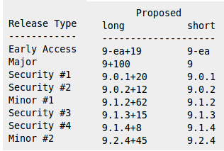
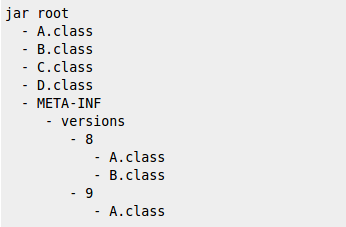

# [Java9](http://openjdk.java.net/projects/jdk9/)
## What's coming


### Roadmap

61 JEPS targeted, 1 proposed

* 18/03/2014 -> Java 8 <!-- .element: class="done" -->
* 10/12/2015 -> <!-- .element: class="inprogress" --> [Feature Complete](http://openjdk.java.net/projects/jdk8/milestones#Feature_Complete) <!-- .element: class="inprogress" -->
* 04/02/2016 -> <!-- .element: class="todo" --> [All Tests Run](http://openjdk.java.net/projects/jdk8/milestones#All_Tests_Run)<!-- .element: class="todo" -->
* 25/02/2016 -> <!-- .element: class="todo" --> [Rampdown Start](http://openjdk.java.net/projects/jdk8/milestones#Rampdown_start)<!-- .element: class="todo" -->
* 21/04/2016 -> <!-- .element: class="todo" --> [Zero Bug Bounce](http://openjdk.java.net/projects/jdk8/milestones#Zero_Bug_Bounce)<!-- .element: class="todo" -->
* 16/06/2016 -> <!-- .element: class="todo" --> [Rampdown Phase 2](http://openjdk.java.net/projects/jdk8/milestones#Rampdown_phase_2)<!-- .element: class="todo" -->
* 21/07/2016 -> <!-- .element: class="todo" --> [Final Release Candidate](http://openjdk.java.net/projects/jdk8/milestones#Final_Release_Candidate)<!-- .element: class="todo" -->
* 22/09/2016 -> <!-- .element: class="todo" --> [General Availability](http://openjdk.java.net/projects/jdk8/milestones#General_Availability)<!-- .element: class="todo" -->

Note:
JEP = JDK Enhancement Proposal, available to JDK committers


### JEP 102: Process API Updates


Java 8

```java
Process proc = Runtime.getRuntime().exec(new String[]{ "/bin/sh", "-c", "echo $PPID" });

if (proc.waitFor() == 0)
{
  InputStream in = proc.getInputStream();
  int available = in.available();
  byte[] outputBytes = new byte[available];

  in.read(outputBytes);
  String pid = new String(outputBytes);

  System.out.println("Your pid is " + pid);
}
```

Note:
Write once run everywhere !!!!!


Java 9

```java
System.out.println("Your pid is " + Process.getCurrentPid());
```


Goals
* get current PID JVM
* get system processes
* handle process trees
* handle subprocesses with multiplexing

Note:
Multiplexing to avoid one thread / subprocess


### JEP 110: HTTP/2 Client


HttpURLConnection API issues 
* API predates HTTP/1.1 and is too abstract
* Hard to use, with many undocumented behaviors
* It works in blocking mode only (i.e., one thread per request/response).


GET
```java
String url = "http://www.zenika.com";
URL obj = new URL(url);
HttpURLConnection con = (HttpURLConnection) obj.openConnection();

con.setRequestMethod("GET"); // optional default is GET
con.setRequestProperty("User-Agent", USER_AGENT); //add request header
int responseCode = con.getResponseCode();

BufferedReader in = new BufferedReader(
  new InputStreamReader(con.getInputStream()));
String inputLine;
StringBuffer response = new StringBuffer();

while ((inputLine = in.readLine()) != null) {
  response.append(inputLine);
}
in.close();
```


POST
```java
String url = "http://www.zenika.com";
URL obj = new URL(url);
HttpsURLConnection con = (HttpsURLConnection) obj.openConnection();

con.setRequestMethod("POST");
//add request header
con.setRequestProperty("User-Agent", USER_AGENT); 
con.setRequestProperty("Accept-Language", "en-US,en;q=0.5");
con.setRequestProperty("Content-Type", 
  "application/x-www-form-urlencoded;charset=UTF8");

String urlParameters = "param1=a&param2=b&param3=c";

// Send post request
con.setDoOutput(true);
DataOutputStream wr = new DataOutputStream(con.getOutputStream());
wr.writeBytes(urlParameters.getBytes("UTF8"));
wr.flush();
wr.close();

int responseCode = con.getResponseCode();
BufferedReader in = new BufferedReader(
  new InputStreamReader(con.getInputStream()));
String inputLine;
StringBuffer response = new StringBuffer();

while ((inputLine = in.readLine()) != null) {
  response.append(inputLine);
}
in.close();
```


Goals
* Asynchronous notification mechanism (headers received, body received)
* Websocket 
* HTTP/2
  * ability to upgrade from 1.1
  * server push


### JEP 201: Modular Source Code
### JEP 220: Modular Run-Time Images


### Project Jigsaw
 <!-- .element: class="jigsaw" -->


1. module system
  * easily scalable down to small computing devices
  * improve security and maintainability
  * enable improved application performance
2. restructure JDK & JRE

Note:
Need to provide build tool to developper


### JEP 222: jshell: The Java Shell


### Project Kulla
Read-Eval-Print Loop

Try it : https://hub.docker.com/r/ensignprojects/javarepl/

Note:
interactive toplevel shell


### JEP 223: New Version-String Scheme


Current numbering scheme issues
* Which version include the more security fixes ? 1.7.0_60 ? 1.7.0_55 ?
```
Minor releases containing changes beyond security fixes 
are multiples of 20. Security releases based on the previous minor 
release are odd numbers incremented by five, or by six if 
necessary in order to keep the update number odd.
```
* "JDK 7 Update 60" = "1.7.0_60" = "JDK 7u60"


`$MAJOR.$MINOR.$SECURITY`
* $MAJOR
  * JDK 8 -> 8
  * JDK 9 -> 9
* $MINOR: $MINOR is reset to zero when $MAJOR is incremented.
* $SECURITY: $SECURITY is reset to zero **only** when $MAJOR is incremented.


Example
  



### JEP 226: UTF-8 Property Files


### JEP 238: Multi-Release JAR Files


Extend the JAR file format to allow multiple, Java-release-specific versions of class files to coexist in a single archive.



https://github.com/hboutemy/maven-jep238

Note:
Ignore later platform, search in current version, then lower version, then root. In a JDK that does not support MRJARs, only the classes and resources in the root directory will be visible


### Misc


JEP 248: Make G1 the Default Garbage Collector

Note:
the Parallel GC, which is currently the default


Unicode
* JEP 227: Unicode 7.0
* JEP 252: Use CLDR Locale Data by Default
* JEP 267: Unicode 8.0

Note:
CLDR : provide locale data in the XML format for use in computer applications


Security
* JEP 219: Datagram Transport Layer Security (DTLS)
* JEP 229: Create PKCS12 Keystores by Default
* JEP 249: OCSP Stapling for TLS
* JEP 244: TLS Application-Layer Protocol Negotiation Extension

Note:
Default keystore : JKS


Compilers, javac, Strings improvement

Jvm logging

Note:
A lot of performance improvement, not seen by developper. few language improvement


# Questions 
